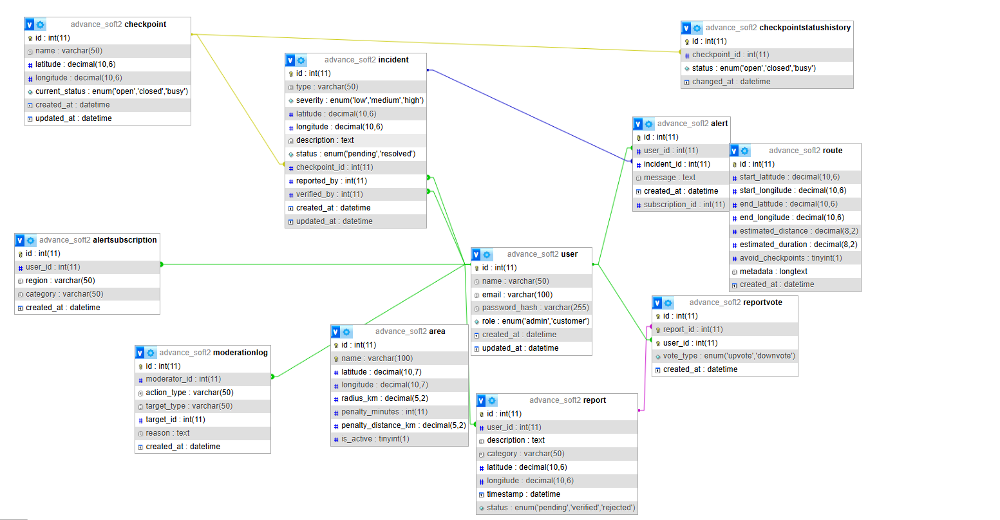

# Wasel Palestine — Smart Mobility & Checkpoint Intelligence Platform

## System Overview

**Wasel Palestine** is an API-centric smart mobility platform designed to help Palestinians navigate daily movement challenges by providing structured, reliable, and real-time mobility intelligence.

The system aggregates data related to:
- road incidents
- checkpoints
- traffic conditions
- environmental factors

All functionality is exposed through a RESTful API (`/api/v1/...`) and designed for integration with mobile apps, dashboards, and third-party systems.

---

## Technology Stack

| Layer              | Technology            | Purpose                          |
|-------------------|---------------------|----------------------------------|
| Backend           | NestJS (Node.js)     | Build scalable API               |
| Database          | MySQL + TypeORM      | Data storage & ORM               |
| Authentication    | JWT                  | Secure user authentication       |
| Authorization     | Roles Guard          | Access control (admin/customer)  |
| Rate Limiting     | @nestjs/throttler    | Prevent abuse & overload         |
| Validation        | class-validator      | Validate request data            |
| Load Testing      | k6                   | Performance testing              |
| API Documentation | API Dog              | API testing & documentation      |
---

## Architecture


---


## Database Relationships (ERD)


The system uses the following relational database relationships:

- **User (1:N) AlertSubscription**  
  One user can create many alert subscriptions.

- **User (1:N) Alert**  
  One user can receive many alerts.

- **User (1:N) Report**  
  One user can submit many reports.

- **User (1:N) ReportVote**  
  One user can vote on many reports.

- **User (1:N) Incident**  
  One user can report or verify many incidents.

- **User (1:N) ModerationLog**  
  One moderator/admin can create many moderation log records.

- **Checkpoint (1:N) Incident**  
  One checkpoint can have many incidents linked to it.

- **Checkpoint (1:N) CheckpointStatusHistory**  
  One checkpoint can have many status history records.

- **Incident (1:N) Alert**  
  One incident can generate many alerts.

- **AlertSubscription (1:N) Alert**  
  One subscription can generate many alerts.

- **Report (1:N) ReportVote**  
  One report can receive many votes.

- **Area (1:N) ModerationLog**  
  One area can be linked to many moderation actions.

- **Route**  
  The route table stores route estimation results and is not directly linked to other tables in the current ERD. 

---

## Authentication

- JWT-based authentication
- Login returns:

```json
{
  "access_token": "..."
}
```

Use in requests:
Authorization: Bearer <token>

## Features
- Feature 1: Road Incidents & Checkpoint Management
Manage checkpoints and incidents
Filtering, sorting, pagination
Role-based control (admin / customer)

Endpoints
GET /incidents
POST /incidents
PATCH /incidents/:id
DELETE /incidents/:id
GET /checkpoints


- Feature 2: Crowdsourced Reporting
Users submit reports
Includes location, category, description
Duplicate detection and moderation workflow


- Feature 3: Route Estimation & Mobility Intelligence
Endpoint
POST /api/v1/routes/estimate

Features
Distance + duration estimation
Avoid checkpoints / areas
Metadata explaining route

External APIs
OSRM → routing
Open-Meteo → weather

Enhancements
caching
timeout handling
graceful failure

- Feature 4: Alerts & Regional Notifications
Functionality
Users subscribe to alerts by region + category
Alerts generated when incidents are verified

Endpoints
POST /alert-subscription
GET /alert-subscription/my
GET /alert/my

Behavior
alerts generated automatically
linked to incident + subscription


# External API Integration API	Purpose
OSRM	route estimation
Open-Meteo	weather data

Handled with:
timeouts
error fallback
caching

## API Documentation & Testing

All APIs documented using API Dog:
endpoint descriptions
request/response
authentication flow
test cases

Testing Strategy
Unit Testing
services tested with Jest

Load Testing (k6)
Scenarios:
read-heavy
write-heavy
mixed
spike
soak


## Performance Summary
Scenario	 -   Result
-------------------------
Read-heavy	   stable
Write-heavy  	 stable
Mixed       	 stable
Soak        	 stable
Spike	       partial failures


# Key Findings
system performance is fast (low latency)
/incidents endpoint stable
/alert/my returned 429 Too Many Requests under spike load

Root Cause
rate limiting (Throttler)

# Conclusion
system performs well under normal load alert endpoint is protected but limited under burst traffic

# Running the Project
npm install
npm run start:dev

# Run load tests:
k6 run k6-tests/feature4/read-heavy.js

# Environment Variables
DB_HOST=127.0.0.1
DB_PORT=3306
DB_USERNAME=root
DB_PASSWORD=
DB_NAME=advance_soft2
JWT_SECRET=123456789

# Final Notes
system is designed for scalability and reliability
rate limiting protects endpoints but affects spike scenarios
architecture supports future integrations and expansion

## Additional Documentation

Detailed documentation for each feature is provided in separate files:

- README_feature1.md  
- README_feature2.md  
- README_feature3.md  
- README_feature4.md  